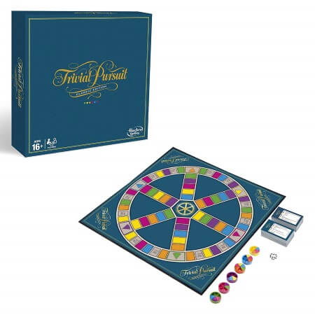

Trivia Refactor Kata
========================

The code represents a game of Trivial Pursuit, a well known game. If interested you can find the rules [here](https://www.boardgameswizard.com/wp-content/uploads/2020/03/TrivialPursuit1980sedition.pdf) but for the purpose of the refactor kata they aren't really necessary. The goal of the kata is to refactor the code, so the game still works. If you encounter bgs you are allowed to fix them. But make sure the game is correct. It is a refactor not a rewrite.

This code base is a fork from the Legacy Code trivia kata. The repository here has been modified from the original to have the latest versions. So it is less suited for a legacy code retreat and more intended as a pure refactor kata. 


## Refactor guarded by Approval tests

Additionally, there is a branch Approval test has added ApprovalTests with optional [TCR scripts](https://medium.com/@kentbeck_7670/test-commit-revert-870bbd756864). Using the kata with these Approval test in place is ideal for practicing pure refactors. 

Can you refactor the code without the tests ever breaking? Can you use the TCR scripts?

## Updated code options

Not all code options have their versions updated to a more recent version. Not all have added approval tests in the approval test branch. The code options ones that are updated are:
+ Java
+ Kotlin
+ Typescript
+ C#
+ NodeJS
+ PHP

## TCR: Test Commit Revert Scripts

The approval test have scripts added for tcr. Simply run

```
./tcr 
```

will run the tests, including the approval tests. If the test pass then a commit is done with the default message "WIP" and push to the remote. If the test fail, the changes made are deleted.




# Acknowledgement 

This code base is a fork from [CaraDojo](https://github.com/caradojo/trivia) and [J. B. Rainsberger](https://github.com/jbrains/trivia) Legacy Code retreat trivia. The repository here has been modified from the original to have the latest versions. So it is less suited for a legacy code retreat and more intended as a pure refactor kata. 


